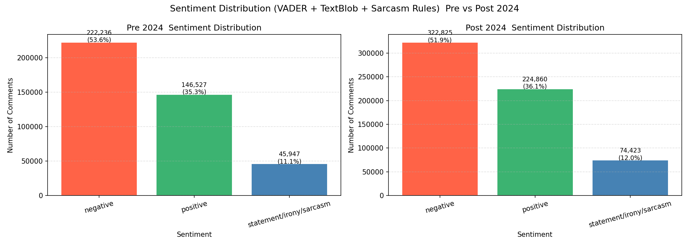
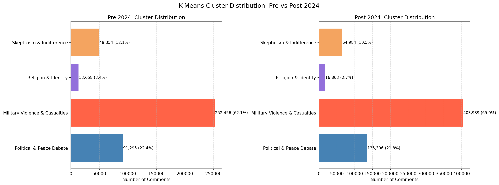
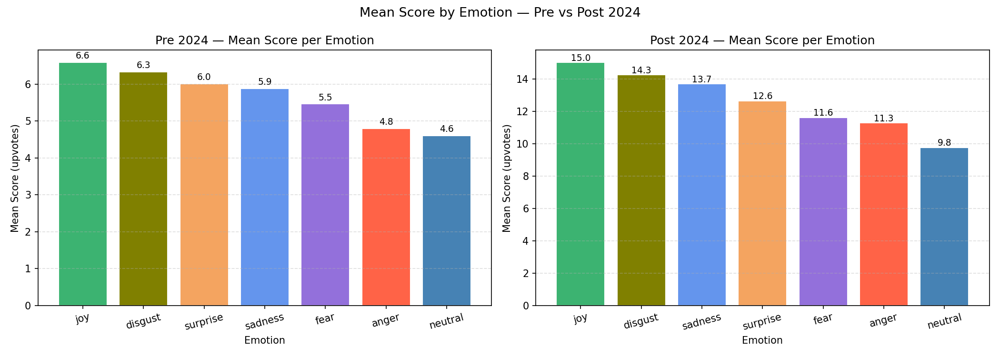
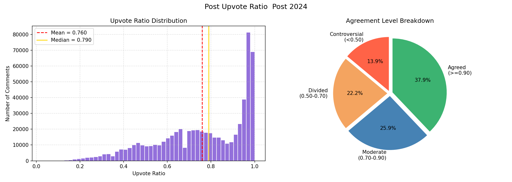

# Large-Scale Reddit Sentiment & Topic Analysis

A full NLP pipeline analyzing over 1 million real-world Reddit comments to detect sentiment, emotion, and shifting discussion themes around a major real-world event.

## Key Results
- Cleaned **41.8M+ raw comments** down to **1.03M high-quality records** (97.5% noise removed) across two time-split corpora
- Applied **LDA topic modeling** and **K-Means clustering** on TF-IDF vectors, tracking a dominant discussion cluster grow from **60.9% to 64.9%** of all comments after a major event
- Built a **2-layer sentiment and emotion detection pipeline** (VADER, TextBlob, HuggingFace transformer), processing 1M+ comments on GPU
- Trained and compared **5 classifiers** with cross-validation and hyperparameter tuning on 331K+ samples, reaching **78.8% accuracy**

## Methods
1. **Data Cleaning** — 6-stage filtering pipeline (bot removal, topic relevance, word count, engagement, deduplication, time-split)
2. **Sentiment & Emotion Detection** — VADER + TextBlob + custom sarcasm rules, plus HuggingFace DistilRoBERTa for 7-class emotion detection
3. **Unsupervised Learning** — LDA topic modeling (k=7) and MiniBatchKMeans clustering (k=5) on TF-IDF vectors
4. **Supervised Learning** — 5 classifiers (Naive Bayes, Logistic Regression, SGD, SVM, Random Forest) with StratifiedKFold CV and GridSearchCV tuning

## Results

### Sentiment Distribution (Pre vs Post Event)

### Discussion Cluster Shifts

### Engagement by Emotion

### Comment Agreement Levels

## Repository Structure
